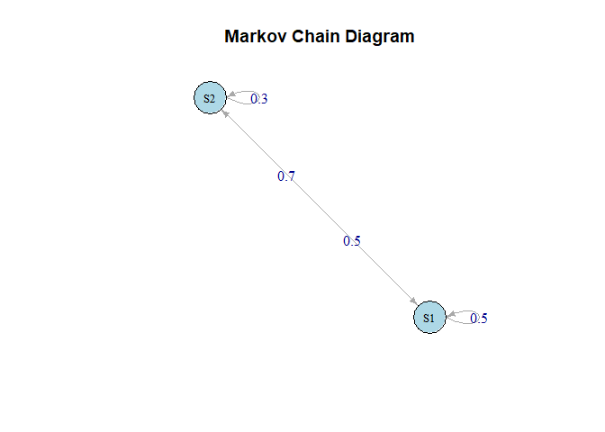

<!-- README.md is generated from README.Rmd. Please edit that file -->

# stochastic

<!-- badges: start -->

<!-- badges: end -->

The goal of stochastic is to provide calculations related to the Markov
chain processes.

## Installation

You can install the development version of stochastic from
[GitHub](https://github.com/) with:

``` r
# install.packages("pak")
pak::pak("thiyangt/stochastic")
```

## Examples

### n-step transition probability matrix

``` r
library(stochastic)
x <- c(0.2,0.8,0.4,0.6)
nstepmat(x, 2, 3)
#> [1] "The one-step transition probability matrix is:"
#>      [,1] [,2]
#> [1,]  0.2  0.8
#> [2,]  0.4  0.6
#> [1] "The 3 -step transition probability matrix is:"
#>       [,1]  [,2]
#> [1,] 0.328 0.672
#> [2,] 0.336 0.664
nstepmat(x, 2, 13)
#> [1] "The one-step transition probability matrix is:"
#>      [,1] [,2]
#> [1,]  0.2  0.8
#> [2,]  0.4  0.6
#> [1] "The 13 -step transition probability matrix is:"
#>           [,1]      [,2]
#> [1,] 0.3333333 0.6666667
#> [2,] 0.3333333 0.6666667
```

### Compute stationary probabilities

``` r
mat <- matrix(c(0.5, 0.5, 0.7, 0.3), byrow=TRUE, ncol=2)
stationary_prob(onestep=mat)
#> [1] 0.5833333 0.4166667
```

### Simulate a Markov Chain process

``` r
init <- c(0.1, 0.9)
mat <- matrix(c(0.5, 0.5, 0.7, 0.3), byrow=TRUE, ncol=2)
simmarkov(init, mat, 100, c("Rainy", "Sunny"))
#>   [1] "Sunny" "Rainy" "Rainy" "Rainy" "Rainy" "Sunny" "Sunny" "Rainy" "Rainy"
#>  [10] "Sunny" "Rainy" "Rainy" "Rainy" "Sunny" "Rainy" "Rainy" "Sunny" "Rainy"
#>  [19] "Rainy" "Rainy" "Sunny" "Sunny" "Rainy" "Rainy" "Sunny" "Rainy" "Sunny"
#>  [28] "Sunny" "Sunny" "Sunny" "Rainy" "Rainy" "Sunny" "Rainy" "Rainy" "Rainy"
#>  [37] "Rainy" "Rainy" "Sunny" "Rainy" "Rainy" "Rainy" "Sunny" "Rainy" "Sunny"
#>  [46] "Rainy" "Sunny" "Sunny" "Sunny" "Rainy" "Sunny" "Sunny" "Rainy" "Sunny"
#>  [55] "Rainy" "Rainy" "Sunny" "Rainy" "Rainy" "Rainy" "Sunny" "Rainy" "Sunny"
#>  [64] "Rainy" "Sunny" "Rainy" "Rainy" "Sunny" "Rainy" "Rainy" "Sunny" "Rainy"
#>  [73] "Rainy" "Sunny" "Rainy" "Rainy" "Rainy" "Sunny" "Rainy" "Sunny" "Rainy"
#>  [82] "Rainy" "Sunny" "Rainy" "Rainy" "Rainy" "Sunny" "Rainy" "Rainy" "Sunny"
#>  [91] "Sunny" "Rainy" "Rainy" "Rainy" "Sunny" "Rainy" "Sunny" "Rainy" "Rainy"
#> [100] "Sunny" "Rainy"
```

### Transition diagram

``` r
plot_markov_chain(mat)
```


